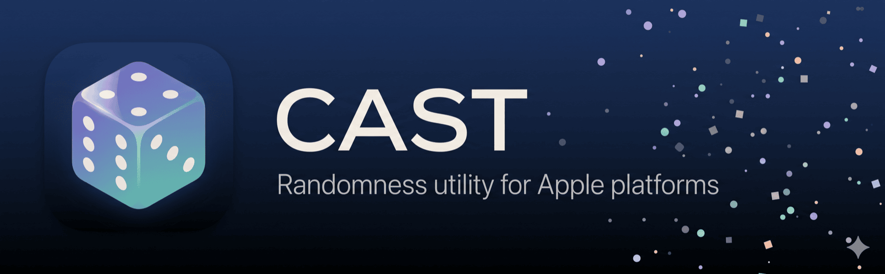
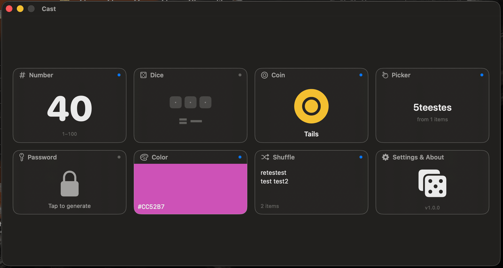
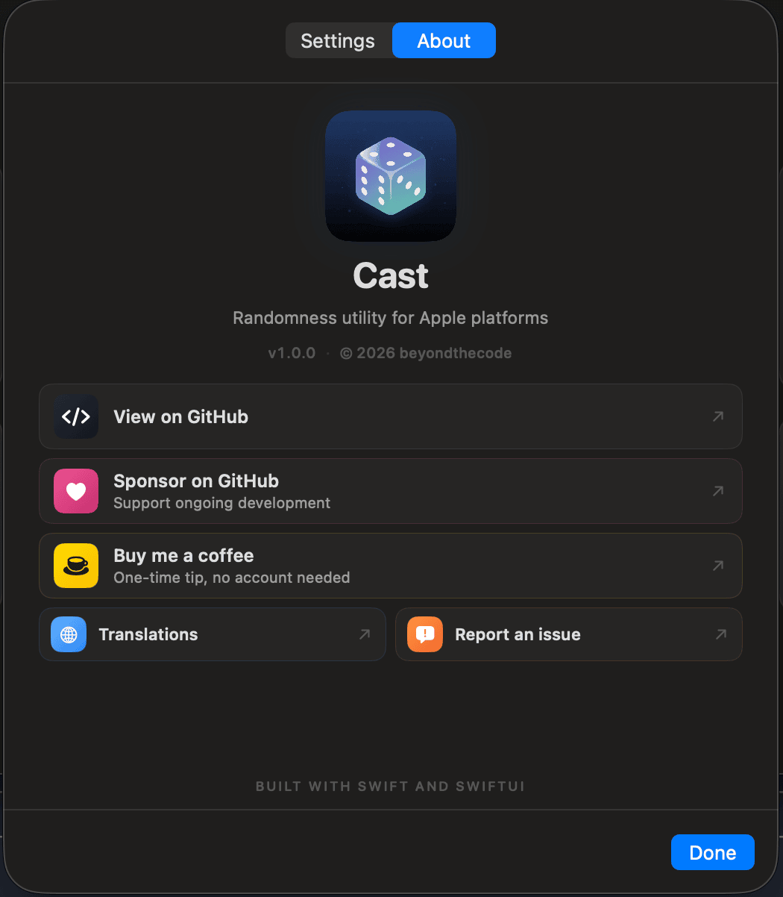

  

  <strong>Randomness utility for Apple platforms</strong> 
  Roll dice, flip coins, pick numbers, generate passwords and colors. A polished, tactile randomness utility built with Swift and SwiftUI.

  
  
  
  

  
  
  
  
  

  
  

  Built with Swift and SwiftUI. No Electron, no web views, no bloat.

---

## Screenshots

<table>
  <tr>
    <td></td>
  </tr>
  <tr>
    <td align="center">All 7 modes on a single canvas — Number, Dice, Coin, Picker, Password, Color, Shuffle — plus live previews of each mode's last cast.</td>
  </tr>
</table>

<table>
  <tr>
    <td></td>
  </tr>
  <tr>
    <td align="center">The About sheet — GitHub, Sponsors, Buy Me a Coffee, Translations, and issue reporting, each with its real brand palette.</td>
  </tr>
</table>

---

## Download

Download the latest version from [**Releases**](https://github.com/beyondthecode-bc/Cast/releases/latest). Unzip, move `Cast.app` to Applications, and launch.

The app includes a built-in update checker -- open **About** and click **Check Now** to see if a newer version is available.

## Features

- **7 randomness modes** — Number, Dice, Coin, Picker, Password, Color, Shuffle. Each gets its own focus view tuned to what the mode does.
- **Tactile delight** — per-mode cast animations, sound effects, and trackpad haptics. All three toggle independently in Settings.[^haptics]
- **Apple Shortcuts integration** — 7 `AppIntents` discoverable in Siri, Spotlight, and Shortcuts.app. Ask "Flip a coin with Cast", "Roll dice with Cast", or build automations.
- **Cryptographically-secure password generation** — 8 – 64 chars, per-class toggles, optional "exclude ambiguous" (0/O, 1/l/I, etc.). Never written to disk.
- **8-language localization** — English, French, German, Spanish, Portuguese (BR), Japanese, Korean, Chinese (Simplified).
- **Accessibility-first** — full VoiceOver labels on every card + control, Reduce Motion automatically drops animations to subtle.
- **Built-in update checker** — queries GitHub Releases. No Sparkle. Toggleable from Settings.

[^haptics]: Haptic feedback requires a Force Touch trackpad (built into every MacBook Pro since 2015, MacBook Air since 2018, and Magic Trackpad 2+). On desktop Macs, older laptops, or when using a regular mouse, macOS silently ignores haptic requests — sounds and animations continue to work unaffected.

## Keyboard Shortcuts

| Shortcut | Action |
|---|---|
| `Space` | Cast (in any focus mode) |
| `Cmd + 1` … `Cmd + 7` | Jump to Number / Dice / Coin / Picker / Password / Color / Shuffle |
| `Cmd + C` | Copy current result |
| `Cmd + [` or `Esc` | Return to home |
| `Cmd + ,` | Open Settings |

## Apple Shortcuts

Cast exposes 7 intents. Each runs without opening the app — useful for automations.

| Intent | Returns |
|---|---|
| Cast a Number | `Int` |
| Roll Dice | `[Int]` rolls + total in the dialog |
| Flip a Coin | `"Heads"` or `"Tails"` |
| Pick from List | `String` |
| Generate Password | `String` |
| Random Color | formatted `String` (HEX/RGB/HSL) |
| Shuffle List | `[String]` |

Sample invocation phrases: "Roll dice with Cast", "Generate a password with Cast", "Pick an item with Cast".

## Requirements

| | Requirement |
|---|---|
| **OS** | macOS 14.0 (Sonoma) or later |
| **Chip** | Any Mac (Apple Silicon or Intel) |

## Getting Started

### 1. Download and install

Download the latest `.zip` from [Releases](https://github.com/beyondthecode-bc/Cast/releases/latest), extract it, and move `Cast.app` to your Applications folder.

### 2. Launch and configure

Launch the app and configure your preferences.

## Translations

This repository hosts the translation files for Cast. You can help translate the app into your language or improve existing translations.

### How to contribute

1. Fork this repository
2. Edit an existing file in the [`languages/`](languages/) folder, or create a new one by copying `English.xml`
3. Translate the string values (the text between `<string>` tags) -- **do not** change the `key` attributes
4. Keep any `%1`, `%2`, `%@`, `%d` placeholders in place -- the app needs them
5. Submit a pull request

### Current languages

| Language | File | Status |
|---|---|---|
| English | [`English.xml`](languages/English.xml) | Complete |
| French | [`French.xml`](languages/French.xml) | Complete |
| German | [`German.xml`](languages/German.xml) | Complete |
| Spanish | [`Spanish.xml`](languages/Spanish.xml) | Complete |
| Japanese | [`Japanese.xml`](languages/Japanese.xml) | Complete |
| Korean | [`Korean.xml`](languages/Korean.xml) | Complete |
| Portuguese (BR) | [`Portuguese.xml`](languages/Portuguese.xml) | Complete |
| Chinese (Simplified) | [`Chinese.xml`](languages/Chinese.xml) | Complete |

Want to add a new language? Copy `English.xml`, rename it to your language name, translate the values, and submit a PR.

## Bug Reports & Feature Requests

Please use [Issues](../../issues) to report bugs or request features.

## Support the Project

If Cast is useful to you, consider supporting development:

  
  &nbsp;&nbsp;&nbsp;
  

---

## Troubleshooting

### "Cast" Not Opened -- Gatekeeper warning

Cast is not yet notarized with Apple. On first launch you may see a Gatekeeper warning.

**To fix this:**

1. Click **Done** to dismiss the dialog
2. Open **System Settings > Privacy & Security**
3. Scroll down -- you'll see a message that Cast was blocked
4. Click **Open Anyway**

This only needs to be done once. After that, the app will open normally.

### Administrator password required when installing an update

When you click **Install Now** in the About window, macOS will show a password prompt before replacing the app in `/Applications`. This is expected -- the app needs elevated permissions to overwrite itself.
